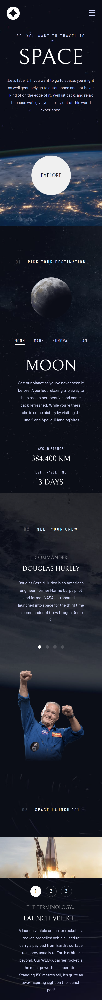
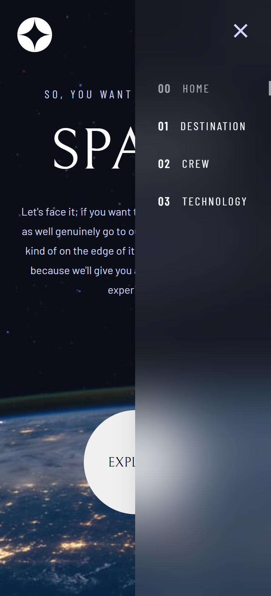

# Frontend Mentor - Space tourism website solution

This is a solution to the [Space tourism website challenge on Frontend Mentor](https://www.frontendmentor.io/challenges/space-tourism-multipage-website-gRWj1URZ3). Frontend Mentor challenges help you improve your coding skills by building realistic projects. 

## Table of contents

- [Overview](#overview)
  - [The challenge](#the-challenge)
  - [Screenshots](#screenshots)
  - [Link](#link)
- [My process](#my-process)
  - [Built with](#built-with)
  - [What I learned](#what-i-learned)
  - [Useful resources](#useful-resources)
- [Author](#author)

## Overview

### The challenge

Users should be able to:

- View the optimal layout for each of the website's pages depending on their device's screen size
- See hover states for all interactive elements on the page
- View each page and be able to toggle between the tabs to see new information

### Screenshots

#### Desktop

 

#### Tablet

 

#### Mobile

 

#### Mobile with opened navbar

 

### Link

- Solution URL: [https://space-tourism-website.up.railway.app/](https://space-tourism-website.up.railway.app/)

## My process

### Built with

- [Svelte / SvelteKit](https://svelte.dev/) - UI and full-stack framework
- [TypeScript](https://www.typescriptlang.org/) - JavaScript with syntax for types
- Semantic HTML5 markup
- pure CSS
- CSS custom properties
- Flexbox
- Mobile-first workflow

### What I learned

After some experience with Svelte v4, I used Svelte v5 for the first time in this project and was able to internalize a lot of new things. I also learned how to create customizable carousels and other components for individual cases.

### Useful resources

- [Fontsource](https://fontsource.org/) - collection of open-source fonts that are packaged into individual NPM packages

## Author

- Frontend Mentor - [@LuckyChimp](https://www.frontendmentor.io/profile/LuckyChimp)
- GitHub - [LuckyChimp](https://github.com/LuckyChimp)